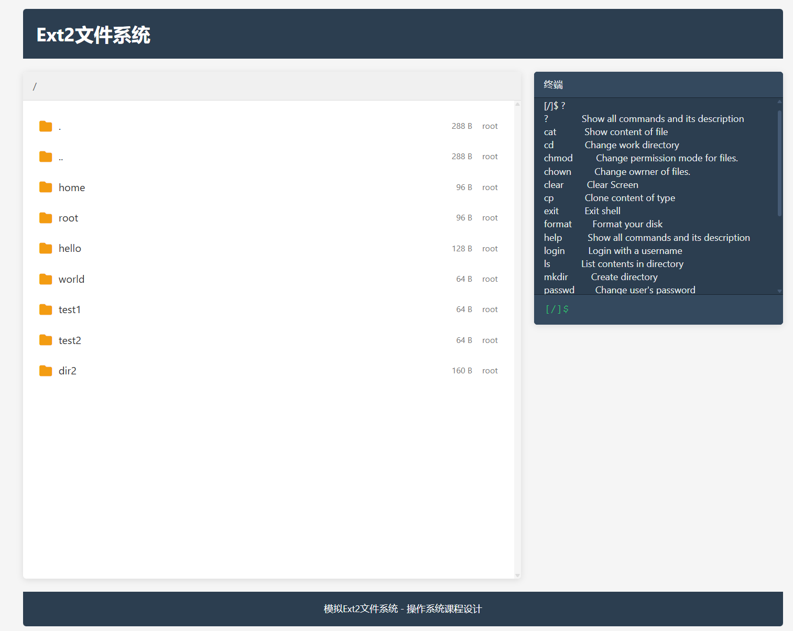

# rust-ext2-fs

> 多用户 / 多目录文件系统 (Unix)

支持用户添加/删除，文件读写，权限控制等功能。提供终端Shell界面和基于Web的可视化图形界面，方便用户直观操作文件系统。



## 代码结构

```
src
├── fs
│  ├── constant.rs   // 定义了一些文件系统的常量，如块大小、磁盘大小等
│  ├── core          // 核心数据结构，磁盘块的管理
│  │  ├── file.rs    // 处理文件权限
│  │  ├── fs.rs      // 整个文件系统 Fs 的定义，磁盘块的回收/删除
│  │  ├── inode.rs   // inode 结点
│  │  ├── iter.rs    // 实现对 DirEntry 的迭代
│  │  ├── mod.rs    
│  │  ├── traits.rs  // 将 Inode / DirEntry 转换成字节数组的 trait
│  │  └── utils.rs   // 常用函数，如字符串与字节数组的转换
│  ├── func          // 拓展文件系统的功能，提供常用的接口
│  │  ├── chdir.rs   // 更改当前目录
│  │  ├── chmod.rs   // 修改权限
│  │  ├── chown.rs   // 修改文件拥有者
│  │  ├── close.rs   // 关闭文件
│  │  ├── create.rs  // 创建文件 / 创建文件夹
│  │  ├── format.rs  // 格式化文件系统
│  │  ├── init.rs    // 从磁盘初始化文件系统
│  │  ├── login.rs   // 登录 / 切换用户
│  │  ├── mod.rs    
│  │  ├── open.rs    // 打开文件
│  │  ├── passwd.rs  // 修改密码
│  │  ├── path.rs    // 简单的路径解析器，实现通过路径查找文件/文件夹
│  │  ├── pwd.rs     // 查看当前目录的绝对路径
│  │  ├── read.rs    // 读文件
│  │  ├── rm.rs      // 删除文件
│  │  ├── rmdir.rs   // 删除空文件夹
│  │  ├── seek.rs    // 修改文件指针
│  │  ├── useradd.rs // 添加用户
│  │  ├── userdel.rs // 删除用户
│  │  └── write.rs   // 写文件
│  └── mod.rs
├── lib.rs
├── main.rs
├── gui               // 可视化图形界面
│  ├── mod.rs         // Web服务器和API实现
│  └── static         // 静态资源文件
│     ├── css         // 样式文件
│     ├── js          // 前端JavaScript代码
│     └── index.html  // 前端页面入口
├── shell            // 模拟一个 shell，使用文件系统提供的接口
│  ├── cmd           // shell 支持的命令
│  │  ├── cat.rs     // 显示文件内容
│  │  ├── cd.rs      // 修改当前目录
│  │  ├── chmod.rs   // 修改文件权限
│  │  ├── chown.rs   // 修改文件拥有者
│  │  ├── cp.rs      // 复制文件
│  │  ├── exit.rs    // 退出终端
│  │  ├── format.rs  // 格式化
│  │  ├── help.rs    // 显示帮助信息
│  │  ├── history.rs // 历史命令管理
│  │  ├── login.rs   // 切换用户
│  │  ├── ls.rs      // 显示目录信息
│  │  ├── mkdir.rs   // 创建文件夹
│  │  ├── mv.rs      // 移动文件或目录
│  │  ├── mod.rs
│  │  ├── passwd.rs  // 修改密码
│  │  ├── pwd.rs     // 查询当前目录
│  │  ├── rm.rs      // 删除文件 / 文件夹
│  │  ├── rmdir.rs   // 删除空文件夹
│  │  ├── touch.rs   // 创建文件
│  │  ├── useradd.rs // 添加用户
│  │  ├── userdel.rs // 删除用户
│  │  ├── users.rs   // 显示用户/密码
│  │  ├── whoami.rs  // 显示当前用户
│  │  └── write.rs   // 写文件
│  ├── history.rs    // 历史命令管理器
│  ├── input.rs      // 输入管理器，支持方向键和编辑
│  └── mod.rs
└── utils.rs
```

## 编译运行

1. 安装 Rust:

  - Linux / Macos

  ```
  curl --proto '=https' --tlsv1.2 -sSf https://sh.rustup.rs | sh
  ```

  - Windows

  [安装 Rustup](https://forge.rust-lang.org/infra/other-installation-methods.html#other-ways-to-install-rustup)

2. 切换到这个目录后运行 `cargo run`

   所有依赖会自动安装，主要包括：
   - chrono: 处理时间和日期
   - crossterm: 终端彩色文本显示
   - actix-web: Web服务器框架
   - serde: 序列化/反序列化支持
   - tokio: 异步运行时
   - env_logger: 日志系统

3. 启动可视化界面:

  ```
  cargo run -- --web
  ```

  启动后可通过浏览器访问 http://localhost:8080 使用Web界面

## 可视化界面

该项目提供了基于Web的可视化界面，方便用户直观地操作文件系统。可视化界面具有以下特点：

- 文件资源管理器：直观显示目录结构和文件
- 文件属性展示：显示文件大小、所有者、权限和时间信息
- 文件内容查看与编辑：双击文件查看内容，支持在线编辑和保存
- 集成终端：在Web界面中执行命令
- 右键菜单：支持在文件区域右键创建文件和文件夹
- 终端高度限制：自动控制终端显示行数，防止内容过多导致界面混乱
- 滚动条优化：为文件列表和终端区域添加自定义滚动条
- 响应式设计：适配不同屏幕尺寸

### GUI交互功能

- **文件浏览**：双击文件夹进入，双击文件查看内容
- **文件编辑**：在文件内容查看对话框中点击"编辑"按钮，可直接修改文件内容并保存
- **右键菜单**：在文件区域空白处右键点击，可以创建新文件或新文件夹
- **终端命令**：支持所有命令行工具，并显示命令执行结果
- **清屏功能**：使用`clear`命令可以清空终端内容
- **历史命令**：使用上下方向键浏览历史命令

### 浏览器兼容性

Web界面已在以下浏览器测试通过：
- Google Chrome

尽量不要使用edge浏览器,会有一些bug

### 系统要求

- 支持现代Web标准的浏览器
- 8080端口可用
- 分辨率建议：1280x720或更高

## 开发环境 

Visual Studio Code.

## 文档编译

cargo doc --no-deps --document-private-items --release --open

## Commit 提交规范

为保持代码提交的一致性和可读性，本项目采用以下commit图标分类：

| 图标 | 类型 | 说明 |
|------|------|------|
| ✨ | feat | 新功能，如添加命令、文件系统新特性等 |
| 🐛 | fix | 修复bug，如修复文件读写错误、权限问题等 |
| 📝 | docs | 文档更新，如README、代码注释等 |
| 💄 | style | 代码格式修改，非功能性更改 |
| ♻️ | refactor | 代码重构，既不修复bug也不添加新功能 |
| ⚡️ | perf | 性能优化，如优化文件存取速度、内存使用等 |
| ✅ | test | 添加或修改测试代码 |
| 🔧 | chore | 构建过程或辅助工具的变动 |
| 🧠 | fs | 文件系统核心逻辑相关的更改 |
| 🖥️ | shell | 命令行Shell相关的更改 |
| 🌐 | gui | 图形界面相关的更改 |
| 🔐 | security | 安全相关更新，如用户权限、数据完整性等 |
| 📦 | storage | 存储机制相关的更改，如磁盘块管理、inode等 |

### 提交格式

```
<图标> <类型>(<范围>): <简短描述>
```

- **图标**: 使用上表中的emoji
- **类型**: 对应图标的类型名称
- **范围**: 可选，表示更改影响的范围，如`fs`、`inode`、`dir`等
- **描述**: 简短描述更改内容

### 提交示例

```
✨ feat(shell): 添加cat命令支持显示二进制文件
🐛 fix(fs): 修复大文件写入时的内存泄漏问题
📝 docs: 更新README文档
💄 style: 统一代码缩进风格
♻️ refactor(core): 重构inode管理逻辑
⚡️ perf(fs): 优化目录项查找算法，提高文件访问速度
✅ test: 添加文件权限测试用例
🔧 chore: 更新Rust依赖版本
🧠 fs: 改进文件系统块分配算法
🖥️ shell: 增强命令行自动补全功能
🌐 gui: 添加文件拖放支持
🔐 security: 增强用户密码存储安全性
📦 storage: 改进磁盘空间回收机制
```

## todo
- [x] 实现rmdir对非空文件夹的递归删除
- [x] 实现fs对硬链接的支持,并添加对应的shell命令
- [x] 实现fs对软链接的支持,并添加对应的shell命令
- [x] 在gui界面添加快捷方式的创建功能
- [x] 实现fs压缩/解压缩功能,并添加对应的shell命令zip和unzip
- [x] 拓展zip和unzip对目录的支持
- [x] 实现mv命令
- [x] 本地终端shell实现记录历史命令,上下方向键浏览历史命令
- [x] web shell实现记录历史命令,上下方向键浏览历史命令
- [x] shell实现tab键自动补全功能
- [x] GUI界面支持文件内容编辑功能
- [x] GUI界面支持对右键文件菜单中进行复制，右键空白区菜单中进行粘贴

## 使用指南

### 启动系统

1. 启动命令行界面：
   ```bash
   cargo run
   ```

2. 启动Web图形界面：
   ```bash
   cargo run -- --web
   ```
   
   然后在浏览器中访问 http://localhost:8080

### Shell功能

#### 自动补全功能
- **Tab键补全**：输入命令或文件路径的前几个字符后按Tab键，系统会自动补全
  - 命令补全：在命令行开头按Tab键补全命令名称
  - 文件路径补全：在参数位置按Tab键补全文件和目录路径
  - 如果有多个匹配项，会显示所有候选项
  - 对于目录，会自动添加 `/` 后缀
  - 连续按Tab键可以循环选择候选项

##### Tab键自动补全测试示例

**1. 命令补全测试**
```bash
# 输入单个字母后按Tab键
[/root] l<Tab>           # 显示: ln  login  ls
[/root] ls<Tab>          # 直接补全为: ls 
[/root] hi<Tab>          # 直接补全为: history 

# 多个匹配时显示所有候选项
[/root] u<Tab>           # 显示: useradd  userdel  unzip
[/root] ch<Tab>          # 显示: chmod  chown
```

**2. 文件路径补全测试**
```bash
# 首先创建一些测试文件和目录
[/root] mkdir documents photos temp
[/root] touch file1.txt file2.txt readme.md config.json
[/root] mkdir documents/projects documents/notes

# 文件补全测试
[/root] cat f<Tab>       # 显示: file1.txt  file2.txt
[/root] cat file1<Tab>   # 直接补全为: cat file1.txt 
[/root] rm r<Tab>        # 直接补全为: rm readme.md 

# 目录补全测试（自动添加斜杠）
[/root] cd d<Tab>        # 直接补全为: cd documents/
[/root] cd documents/<Tab> # 显示: projects/  notes/
[/root] ls p<Tab>        # 显示: photos/
```

**3. 复杂路径补全测试**
```bash
# 多级目录补全
[/root] cd documents/p<Tab>    # 补全为: cd documents/projects/
[/root] ls documents/n<Tab>    # 补全为: ls documents/notes/

# 混合文件类型补全
[/root] cp documents/notes/meeting.txt d<Tab>  # 显示: documents/
```

**4. 空目录和无匹配测试**
```bash
# 空目录测试
[/root] cd temp/
[/root/temp] ls <Tab>    # 无候选项，无响应

# 无匹配的前缀
[/root] cat xyz<Tab>     # 无候选项，无响应
[/root] zzz<Tab>         # 无候选项，无响应
```

**5. 多次Tab键循环选择测试**
```bash
# 创建多个相似文件用于测试
[/root] touch test1.txt test2.txt test3.txt

# 连续按Tab键循环选择
[/root] cat test<Tab>    # 显示所有候选项: test1.txt  test2.txt  test3.txt
[/root] cat test<Tab><Tab><Tab>  # 依次循环: test1.txt -> test2.txt -> test3.txt
```

**6. 完整的文件操作测试序列**
```bash
# 创建测试环境
[/root] mkdir -p workspace/src workspace/docs workspace/tests
[/root] touch workspace/src/main.rs workspace/src/lib.rs
[/root] touch workspace/docs/readme.md workspace/docs/guide.md
[/root] touch workspace/tests/test1.rs workspace/tests/test2.rs

# 测试补全功能
[/root] cd w<Tab>               # 补全为: cd workspace/
[/root] cd workspace/s<Tab>     # 补全为: cd workspace/src/
[/root] cat workspace/src/m<Tab> # 补全为: cat workspace/src/main.rs
[/root] cp workspace/src/lib.rs workspace/d<Tab> # 补全为: workspace/docs/
[/root] mv workspace/tests/t<Tab> # 显示: test1.rs  test2.rs
```

**7. 特殊字符和混合内容测试**
```bash
# 创建包含特殊字符的文件
[/root] touch "file with spaces.txt" file-dash.txt file_underscore.txt

# 补全测试（注意：当前实现可能对包含空格的文件名处理有限）
[/root] cat file<Tab>    # 显示所有以file开头的文件
[/root] cat file-<Tab>   # 补全为: cat file-dash.txt
[/root] cat file_<Tab>   # 补全为: cat file_underscore.txt
```

**8. 错误输入恢复测试**
```bash
# 输入错误后使用补全纠正
[/root] cta<Backspace><Backspace><Backspace>cat f<Tab>  # 修正命令并补全文件
[/root] ls /roto<Backspace><Backspace>ot/<Tab>          # 修正路径并补全
```

#### 历史命令功能
- **上下方向键**：浏览之前输入的命令历史
- **历史命令管理**：
  - `history` - 显示所有历史命令
  - `history -n 10` - 显示最近10条命令
  - `history -c` - 清空历史记录
  - 历史记录自动保存在 `.shell_history` 文件中

#### 快捷键
- **Ctrl+L**：清屏
- **Ctrl+C**：中断当前输入
- **Home/End**：光标移动到行首/行尾
- **左右方向键**：光标在当前行内移动
- **Backspace/Delete**：删除字符

### 文件系统基本操作

#### 通过GUI界面操作

1. **浏览文件**：
   - 在左侧文件浏览器中可以看到当前目录下的所有文件和文件夹
   - 双击文件夹进入该目录
   - 双击文件查看文件内容（使用cat命令）
   - 双击 `..` 返回上级目录

2. **编辑文件**：
   - 双击文件打开内容查看对话框
   - 点击对话框底部的"编辑"按钮
   - 在弹出的编辑对话框中修改文件内容
   - 点击"保存"按钮保存更改，或点击"取消"放弃修改

3. **创建文件和文件夹**：
   - 在文件区域的空白处点击鼠标右键
   - 从弹出菜单中选择"新建文件"或"新建文件夹"
   - 在弹出的对话框中输入名称
   - 点击"创建"按钮或按回车键确认

4. **使用终端**：
   - 右侧终端区域支持所有命令行操作
   - 输入命令并按回车执行
   - 使用上下方向键浏览历史命令
   - 输入 `clear` 或 `ctrl+L` 清空终端内容
   - 输入 `help` 或 `?` 查看所有可用命令

#### 常用命令

| 命令 | 说明 | 示例 |
|------|------|------|
| `ls` | 列出当前目录内容 | `ls` 或 `ls -l` |
| `cd` | 切换目录 | `cd /home` |
| `pwd` | 显示当前目录 | `pwd` |
| `mkdir` | 创建文件夹 | `mkdir docs` |
| `touch` | 创建空文件 | `touch file.txt` |
| `cat` | 查看文件内容 | `cat file.txt` |
| `write` | 写入文件内容 | `write file.txt` |
| `cp` | 复制文件或目录 | `cp file.txt backup.txt` 或 `cp -r dir1 dir2` |
| `mv` | 移动文件或目录 | `mv file.txt newname.txt` 或 `mv -r dir1 dir2` |
| `rm` | 删除文件 | `rm file.txt` |
| `rmdir` | 删除空文件夹 | `rmdir docs` |
| `ln` | 创建硬链接 | `ln target link_name` |
| `ln -s` | 创建软链接 | `ln -s target link_name` |
| `history` | 显示历史命令 | `history` 或 `history -n 10` |
| `useradd` | 添加用户 | `useradd username password` |
| `userdel` | 删除用户 | `userdel username` |
| `login` | 切换用户 | `login username` |
| `whoami` | 显示当前用户 | `whoami` |
| `chmod` | 修改文件权限 | `chmod rwx:r-- file.txt` |
| `chown` | 修改文件所有者 | `chown username file.txt` |


### 用户和权限管理

1. **默认用户**：
   - 用户名：`root`
   - 密码：`123`

2. **添加新用户**：
   ```
   useradd username password
   ```

3. **切换用户**：
   ```
   login username
   ```

4. **修改文件权限**：
   ```
   chmod rwx:r-- file.txt
   ```
   权限格式为 `所有者权限:其他用户权限`，每组权限由r(读)、w(写)、x(执行)或-(无权限)组成。

5. **修改文件所有者**：
   ```
   chown username file.txt
   ```

### 故障排除

1. **无法启动Web界面**：
   - 检查8080端口是否被占用
   - 使用 `pkill -9 simulate_unixlike_fs` 关闭已运行的实例
   - 确保已安装必要的依赖项

2. **文件操作失败**：
   - 检查当前用户是否有足够权限
   - 使用 `whoami` 确认当前用户
   - 检查文件路径是否正确
   - 使用 `pwd` 确认当前目录

#### 测试样例

# 登录系统 (默认root/123)
[/] login
username: root
password: 123
Login successful!

# 1. 查看当前用户
[/root] whoami
root

# 2. 显示命令帮助
[/root] ?/help
?             Show all commands and its description

# 3. 创建目录、cd操作和显示路径
[/root] mkdir test
[/root] cd test
[/root/test] mkdir test4
[/root/test] pwd
/root/test

# 4. 创建文件、写文件
[/root/test] touch file1.txt
[/root/test] write file1.txt
Enter content (end with empty line):
Hello World!
This is a test file.
# 5. 展示文件内容
[/root/test] cat file1.txt
Hello World!
This is a test file.

# 6. 复制文件
[/root/test] cp file1.txt file2.txt
[/root/test] cp -r test4 test4_2
[/root/test] ls

file1.txt file2.txt

# 7. 链接创建
[/root/test] ln file1.txt hardlink
[/root/test] ln -s file2.txt symlink
[/root/test] ls

file1.txt file2.txt hardlink symlink

[/root/test]  cat hardlink
Hello World!This is a test file.
[/root/test]  cat symlink 
Hello World!This is a test file.
# 8. 用户管理(创建和展示用户)
[/root/test] useradd alice 123
New user 'alice' added
[/root/test] passwd alice
New password:  alice123
Press again:   alice123
[/root/test] users
User Name        Password        
root             123             
alice             alice123 
# 9. 压缩和解压文件
[/root/test] zip file1.txt files.zip            
File compressed successfully!
Original size: 33 bytes
Compressed size: 37 bytes (including 4-byte header)
Compression ratio: 112.12%
解压缩：
[/root/test] unzip files.zip file.txt
File decompressed successfully!
Compressed size: 37 bytes (including 4-byte header)
Decompressed size: 33 bytes
[/root/test] ls
Name
.
..
file1.txt
file2.txt
hardlink
symlink -> file2.txt
files.zip
file.txt
[/root/test] cat file.txt
Hello World!This is a test file.

# 10 同时删除多个文件
[/test] rm file1.txt file2.txt
[/root/test]  rm file1.txt file2.txt
[/root/test] ls  
Name
.
..
hardlink
symlink -> file2.txt
files.zip
file.txt

# 10. 删除目录
[/] cd ..
[/] mkdir test1
[/] rmdir test1
[/]mkdir test2
[/]cd test2
[/] touch file1.txt
[/]cd ..
[/] rm -r test2

# 11.权限修改
[/root/test] chmod rwx:r-- file.txt
[/root/test] cd ..
[/root] touch file2.txt
[/root] chmod rwx:r-- file2.txt
[/root]chown alice /root/file2.txt

# 12. 切换用户
[/root/test] login
:: default user: root, password: 123
username: alice
password: 123

去往test文件夹下
[/home/alice] ls
Name
.
..
[/home/alice] cd ..
[/home] cd /
[/] ls
Name
.
..
home
root
1.txt
1.txt_shortcut -> 1.txt
[/] cd root
[/root] cd test
写处理的权限判断
[/root/test] write file.txt     
file.txt: Need write permission

# 13. 所有权管理 (需root)的判断
[/root/test] chown alice file.txt
Permission denied
[/root/test] cd ..
[/root] write file2.txt

# 14. 退出系统
[/] exit
Connection closed.

# 11. 格式化
[/home/alice] cd /                       
[/] chown alice /home/alice
[/]  format /home/alice    
!!! This opretion will wipe all data in this disk
!!! Continue ? [Y/N]   y
[/] cd home
[/home] ls
Name
.
..
[/home] 


#### 测试样例

# 登录系统 (默认root/123)
[/] login
username: root
password: 123
Login successful!

# 1. 查看当前用户
[/root] whoami
root

# 2. 显示命令帮助
[/root] ?/help
?             Show all commands and its description

# 3. 创建目录、cd操作和显示路径
[/root] mkdir test
[/root] cd test
[/root/test] mkdir test4
[/root/test] pwd
/root/test

# 4. 创建文件、写文件
[/root/test] touch file1.txt
[/root/test] write file1.txt
Enter content (end with empty line):
Hello World!
This is a test file.
# 5. 展示文件内容
[/root/test] cat file1.txt
Hello World!
This is a test file.

# 6. 复制文件
[/root/test] cp file1.txt file2.txt
[/root/test] cp -r test4 test4_2
[/root/test] ls

Name
.
..
test4
file1.txt
file2.txt
test4_2


# 7. 链接创建
[/root/test] ln file1.txt hardlink
[/root/test] ln -s file2.txt symlink
[/root/test] ls

file1.txt file2.txt hardlink symlink

[/root/test]  cat hardlink
Hello World!This is a test file.
[/root/test]  cat symlink 
Hello World!This is a test file.
# 8. 用户管理(创建和展示用户)
[/root/test] useradd alice 123
New user 'alice' added
[/root/test] passwd alice
New password:  alice123
Press again:   alice123
[/root/test] users
User Name        Password        
root             123             
alice             alice123 
# 9. 压缩和解压文件
[/root/test] zip file1.txt files.zip            
File compressed successfully!
Original size: 33 bytes
Compressed size: 37 bytes (including 4-byte header)
Compression ratio: 112.12%
解压缩：
[/root/test] unzip files.zip file
File decompressed successfully!
Compressed size: 37 bytes (including 4-byte header)
Decompressed size: 33 bytes
[/root/test] ls
Name
.
..
file1.txt
file2.txt
hardlink
symlink -> file2.txt
files.zip
File
[/root/test] cd file
[/root/test/file] cat file1.txt
Hello World!This is a test file.

# 10 同时删除多个文件
[/root/test]  rm file1.txt file2.txt
[/root/test] ls  
Name
.
..
hardlink
symlink -> file2.txt
files.zip
file.txt

# 10. 删除目录
[/] cd ..
[/] mkdir test1
[/] rmdir test1
[/]mkdir test2
[/]cd test2
[/] touch file1.txt
[/]cd ..
[/] rm -r test2

# 11.权限修改
[/root/test]cd file
[/root/test/file] chmod rwx:r-- file1.txt
[/root/test] cd ..
[/root] touch file2.txt
[/root] chmod rwx:r-- file2.txt
[/root]chown alice /root/file2.txt

# 12. 切换用户
[/root/test] login
:: default user: root, password: 123
username: alice
password: 123

去往test文件夹下
[/home/alice] ls
Name
.
..
[/home/alice] cd ..
[/home] cd /
[/] ls
Name
.
..
home
root
1.txt
1.txt_shortcut -> 1.txt
[/] cd root
[/root] cd test
[/root/test]cd file
写处理的权限判断
[/root/test/file] write file1.txt     
file.txt: Need write permission

# 13. 所有权管理 (需root)的判断
[/root/test/file] chown alice file1.txt
Permission denied
[/root/test] cd ..
[/root] write file2.txt  #这里前面只设置了读权限，但是后来把整个文件的权限都给了alice用户，因此这里应该是成功的

# 14. 退出系统
[/] exit
Connection closed.

# 11. 格式化                     
[/]  format  
!!! This opretion will wipe all data in this disk
!!! Continue ? [Y/N]   y
[/] cd home
[/home] ls
Name
.
..
[/home] 
